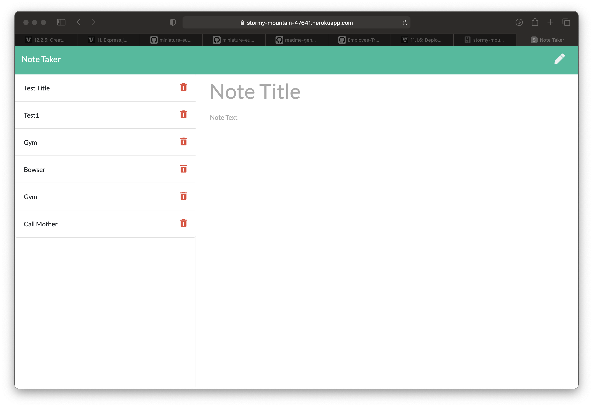
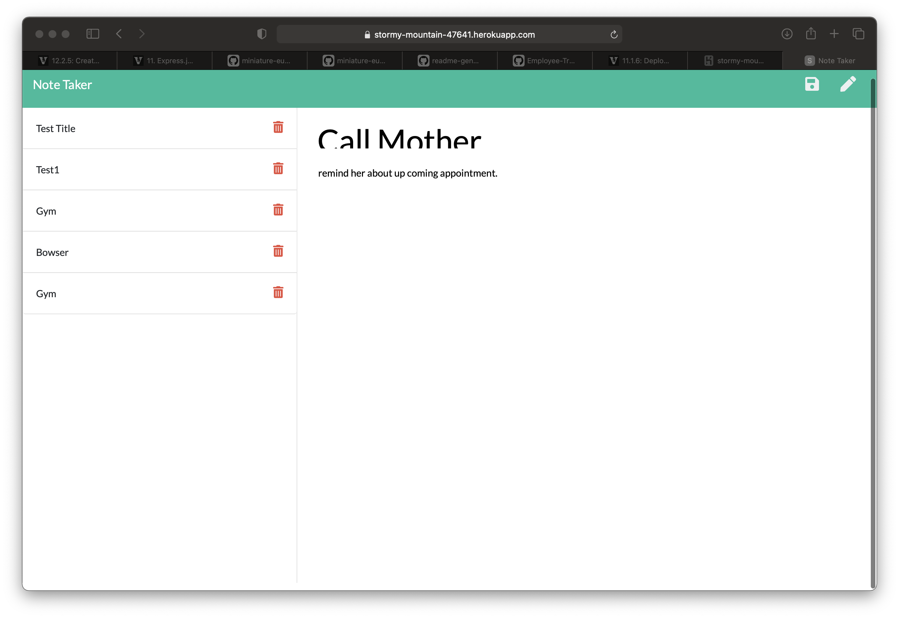

# Note-Taker

  ## Table of Contents:
  * [Description](#description)
  * [Installation](#installation)
  * [Usage](#usage)
  * [Questions](#questions)

  ## Description:
   Note Taker can be used to write and save notes. This application will use an Express.js back end and will save and retrieve note data from a JSON file.

  ## Installation:
  npm Express.js 

  ## Usage:
  
  <!--  -->

  ## Questions:
  If you have any questions please reach out to me at:

  GitHub - https://github.com/jrjensen14
  
  Email - jrjensen@gmail.com
